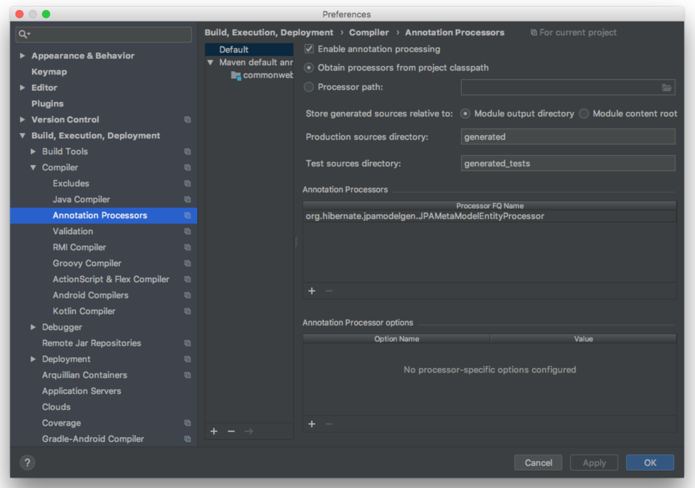

# 스프링 데이터 JPA: Specifications
> 에릭 에반스의 책 DDD에서 언급하는 Specification 개념을 차용 한 것으로 QueryDSL의 Predicate와 비슷합니다  
 
## 설정 하는 방법
https://docs.jboss.org/hibernate/stable/jpamodelgen/reference/en-US/html_single/
#### 1. 의존성 설정
```xml
<dependency>
    <groupId>org.hibernate</groupId>
    <artifactId>hibernate-jpamodelgen</artifactId>
</dependency>
```

#### 2. 플러그인 설정
```xml
<plugin>
    <groupId>org.bsc.maven</groupId>
    <artifactId>maven-processor-plugin</artifactId>
    <version>2.0.5</version>
    <executions>
        <execution>
            <id>process</id>
            <goals>
                <goal>process</goal>
            </goals>
            <phase>generate-sources</phase>
            <configuration>
                <processors>                                
                    <processor>org.hibernate.jpamodelgen.JPAMetaModelEntityProcessor</processor>
                </processors>
            </configuration>
        </execution>
    </executions>
    <dependencies>
        <dependency>
            <groupId>org.hibernate</groupId>
            <artifactId>hibernate-jpamodelgen</artifactId>
            <version>${hibernate.version}</version>
        </dependency>
    </dependencies>
</plugin>
```

#### 3. IDE에 애노테이션 처리기 설정
- Build, Execution, Deployment -> Compiler -> Annotation Processors
- Enable annotation processing 체크  
- Annotation Processors 에 `org.hibernate.jpamodelgen.JPAMetaModelEntityProcessor` 추가  
  

  
> 설정을 하고 maven clean 후 Project Build를 하면 target/generated-sources에 파일이 만들어짐  
> IDE에서는 문제가 없지만 패키징시 문제가 없으려면 위의 플러그인 설정이 필요함  
  
## 실습
#### Repository 인터페이스에 JpaSpecificationExecutor 추가
```java
public interface CommentRepository extends JpaRepository<Comment, Long>, JpaSpecificationExecutor<Comment> {
 
}
```

#### CommentSpecs 클래스 생성
> 스펙 정의  
```java
public class CommentSpecs {

    // comment가 best인지 판단하는 스펙
    public static Specification<Comment> isBest() {
        return new Specification<Comment>() {
            @Override
            public Predicate toPredicate(Root<Comment> root, CriteriaQuery<?> query, CriteriaBuilder builder) {
                return builder.isTrue(root.get(Comment_.best));
            }
        };
    }

    // comment가 up이 10이상인지 판단하는 스펙
    public static Specification<Comment> isGood() {
        return new Specification<Comment>() {
            @Override
            public Predicate toPredicate(Root<Comment> root, CriteriaQuery<?> query, CriteriaBuilder builder) {
                return builder.greaterThanOrEqualTo(root.get(Comment_.up), 10);
            }
        };
    }
}
```

#### 테스트 코드
> static import로 간결하게 처리 가능  
```java
import static me.freelife.springdatajpautilizestudy.post.CommentSpecs.isBest;
import static me.freelife.springdatajpautilizestudy.post.CommentSpecs.isGood;

@Test
public void specs() {
    // comments.findAll(CommentSpecs.isBest().or(CommentSpecs.isGood()));
    // static import를 사용해서 코드를 간결하게 함
    comments.findAll(isBest().or(isGood()));
    // Page로도 받을 수 있음
    Page<Comment> page = comments.findAll(isBest().or(isGood()), PageRequest.of(0, 10));
}
```

## 장점
- 서버쪽에는 여러가지 설정을 해줬지만 클라이언트 코드가 간단해짐
- 클라이언트 코드는 좋음 Spec를 어떻게 정의 했냐에 따라 가독성도 좋아짐
- QueryDSL의 predicate 와 Specification를 사용하면 Repository 쿼리 메서드를 많이 추가 하지 않아도  
- 여러가지 기능을 구현할 수 있고 따로 각각 정의하고 조합할 수 있고 이름도 원하는대로 줄 수 있어서 편리함  
> **단 여러가지 조합을 하는 경우 테스트를 철저하게 해야 함**  