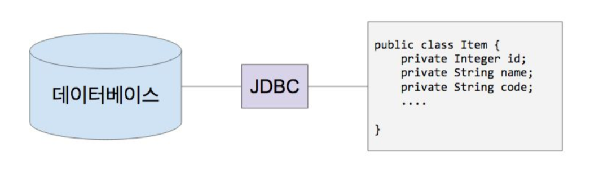

# 핵심 개념 이해
본격적인 스프링 데이터 JPA 활용법을 학습하기에 앞서, ORM과 JPA에 대한 이론적인 배경을 학습합니다  

# 1. 관계형 데이터베이스와 자바
> Persistence(영속성)이란 어떤 정보를 어딘가에 저장하고 애플리케이션을 껐다가 켜도 그 데이터는 유지가 됨  
## JDBC
- (관계형) 데이터베이스와 자바의 연결 고리  
  

  
### JDBC
- DataSource / DriverManager
- Connection
- PreparedStatement

### SQL
- DDL
- DML

### 무엇이 문제인가?
- SQL을 실행하는 비용이 비싸다.
- SQL이 데이터베이스 마다 다르다.
- 스키마를 바꿨더니 코드가 너무 많이 바뀌네...
- 반복적인 코드가 너무 많아.
- 당장은필요가없는데언제쓸줄모르니까미리다읽어와야하나...
  
## Docker 명령어 설명
### 옵션
- -e: 환경변수
- -d: daemon 명
- -name: docker 프로세스 명
- -i: 인터렉티브 모드
- -t: target 이 되는 container
- bash: 실행할 명령어
### 명령어
- docker ps: docker 프로세스 보기
- docker ps -a: 동작하지 않는 docker container 까지 보기
- docker rm: docker 컨테이너 삭제
- docker stop: docker container stop
- docker start: docker container start

## Docker PostgreSQL 설치 및 실행
1. 설치
```bash
docker run -p 5432:5432 -e POSTGRES_PASSWORD=pass -e POSTGRES_USER=freelife -e POSTGRES_DB=springboot --name postgres_boot -d postgres
```

2. 접속
```bash
docker exec -i -t postgres_boot bash
```

3. postgres 유저 전환
```bash
su - postgres
```

4. postgres psql 실행
> psql에 접속할 데이터베이스 이름  
```bash
psql -U freelife springboot
```

1. 조회
- 데이터베이스 조회
```bash
\list
```
#### 테이블 조회
```bash
\dt
```
#### 쿼리
```sql
SELECT * FROM account;
```

## SQL
- DDL: 스키마 추가, 수정, 삭제
- DML: 데이터 추가, 수정, 삭제

## JDBC 드라이버 의존성 추가
> JDBC는 Java안에 기본으로 포함되어있음 드라이버만 설치하면됨  
- PostgreSQL 용 드라이버 의존성 추가  
```xml
<dependencies>
    <dependency>
        <groupId>org.postgresql</groupId>
        <artifactId>postgresql</artifactId>
        <version>RELEASE</version>
    </dependency>
</dependencies>
```

## 문제점
- 클래스와 맵핑되는 테이블을 생성하는 것이 번거로움
- 테이블에서 가져온 데이터를 도메인 객체로 맵핑하는 과정도 번거로움
- connection을 만드는 비용이 비싸다 또한 마음대로 만들 수 없다
  - DBCP라고 부르는 Connection Pool 오픈소스를 사용해 POOL로 관리를 한다
  - Spring Boot는 Hikari라는 툴을 사용9
  - 빈이 connection 객체를 미리 만들어 놓고 POOL에서 필요할 때 마다 하나씩 받아서 씀
- SQL이 표준이 있지만 DB마다 다름 DB를 교체하면 SQL을 다시 작성해야됨
- 반복적인 코드가 많음
- 언젠가 쓸지몰라서 미리 다 읽어오는 경우가 있음

## 테스트 로직 구현
> 접근할때는 try with resource 라는 Java8부터 도입된 문법을 사용  
> DDL로 테이블 생성후, DML로 데이터를 Insert  
```java
public class Application {

    public static void main(String[] args) throws SQLException {
        String url = "jdbc:postgresql://localhost:5432/springboot";
        String username = "freelife";
        String password = "pass";

        try(Connection connection = DriverManager.getConnection(url, username, password)){
            System.out.println("Connection created: "+ connection);
            String sql = "CREATE TABLE ACCOUNT (id int, username varchar(255), password varchar(255));";
            sql = "INSERT INTO ACCOUNT VALUES(1, 'freelife', 'pass');";
            try(PreparedStatement statement = connection.prepareStatement(sql)){
                statement.execute();
            }
        }
    }
}
```