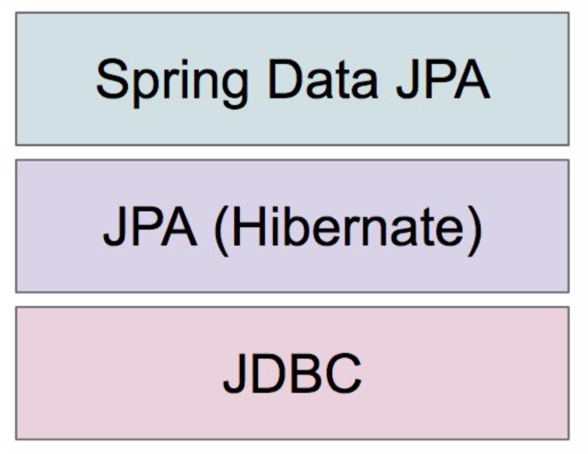

# 스프링 데이터 JPA
> JPA(Java Persistence API)를 보다 쉽게 사용할 수 있도록 여러 기능을 제공하는 ​스프링 데이터 JPA​에 대해 학습합니다  

## 왜 JPA를 학습해야 하는가?
- 도메인 주도 개발이 가능합니다.
- 애플리케이션의 코드가 SQL 데이터베이스 관련 코드에 잠식 당하는 것을 방지하고 도메인 기반의 프로그래밍으로 비즈니스 로직을 구현하는데 집중할 수 있습니다
- 그리고 개발 생산성에 좋으며, 데이터베이스에 독립적인 프로그래밍이 가능하고, 타입 세이프한 쿼리 작성 그리고 Persistent Context가 제공하는 캐시 기능으로 성능 최적화까지 가능합니다

> 이러한 여러 장점을 지닌 JPA의 한가지 단점. 높은 학습 비용. 이번 강좌가 그 학습 비용을 조금이라도 낮추는데 도움이 되길 바랍니다

## 학습 목표
- ORM(Object-Relation Mapping)에 대해 이해합니다
- JPA를 사용할 때 반드시 알아야 하는 특징을 이해합니다
- 스프링 데이터 JPA의 구동 원리를 이해합니다
- 스프링 데이터 JPA를 사용하여 다양한 방법으로 Repository를 구현할 수 있습니다
- 스프링 데이터 JPA를 사용하여 다양한 방법으로 쿼리를 만들고 실행할 수 있습니다

## 학습 목차
### 핵심 개념 이해
- 관계형 데이터베이스와 자바
- ORM이 해결하려는 문제 (패러다임 불일치)
- JPA의 특징 이해
- 스프링 데이터 JPA 원리 이해
- 스프링 데이터 JPA 활용

### 스프링 부트 연동
- 리포지토리
- 엔티티저장
- 쿼리
- 스토어드 프로시져
- 트랜잭션
- Auditing

# 강좌 소개
Application -> 스프링 데이터 JPA (-> JPA -> JDBC) -> Database  
  
