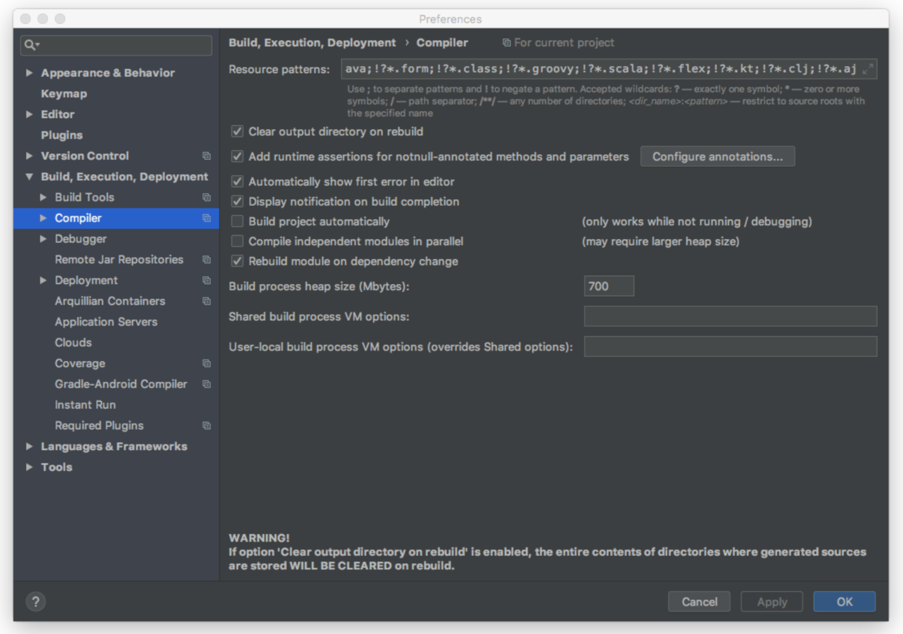

# 스프링 데이터 Common: Null 처리하기
## 스프링 데이터 2.0 부터 자바 8의 Optional 지원
- 단일 값을 사용하는 경우 Optional로 처리하는 것을 추천  
- 콜렉션은 Null을 리턴하지 않고, 비어있는 콜렉션을 리턴  
- Optional 인터페이스가 제공하는 메서드를 사용해서 검사할 수 있음  
```java
Optional<Post> findById(Long id);
```

### Optional 메서드
- isPresent() : 값이 있는지 없는지 확인
- orElse : 없는 경우 다른 대체적인 인스턴스를 리턴하게 할 수도 있음
- orElseThrow : 없는 경우 예외를 던짐

### Optonal 단일 값 리턴 실습 코드
#### MyRepository에 Optional<E> findById 추가
```java
@NoRepositoryBean
public interface MyRepository<T, Id extends Serializable> extends Repository<T, Id> {
    <E extends T> E save(E entity);
    List<T> findAll();
    long count();

    <E extends T> Optional<E> findById(Id id);
}
```

#### CommentRepositoryTest 테스트 코드 작성
> Optional 타입의 인스턴스가 나오므로 Null로 체크 하는 것이 아님  
> Comment가 null이어서 안이 비어있다고 isEmpty로 Optional 을 검사  
```java
@RunWith(SpringRunner.class)
@DataJpaTest
public class CommentRepositoryTest {

    @Autowired
    CommentRepository commentRepository;

    @Test
    public void crud() {
        Optional<Comment> byId = commentRepository.findById(100l);
        assertThat(byId).isEmpty();
        //Comment comment = byId.orElse(new Comment()); // Optional 객체가 비어있으면 Comment 만들어서 리턴
        //Comment comment = byId.orElseThrow(() -> new IllegalArgumentException());
        Comment comment = byId.orElseThrow(IllegalArgumentException::new); // lambda를 메서드 레퍼런스로 변환 
    }
}
```

#### Optional 을 사용하지 않고 처리 하면 아래와 같이 구현함
```java
Comment comment = commentRepository.findById(100l);
if (comment == null)
    throw new IllegalArgumentException();
```

### List 리턴 실습 코드
> 스프링 데이터 JPA가 지원하는 Repository의 컬렉션 타입들은 null이 되지 않고 비어있는 컬렉션 타입을 리턴해줌  
> 컬렉션을 null 체크하는 로직은 필요없음  
```java
@RunWith(SpringRunner.class)
@DataJpaTest
public class CommentRepositoryTest {

    @Autowired
    CommentRepository commentRepository;

    @Test
    public void crud() {
        List<Comment> comments = commentRepository.findAll();
        assertThat(comments).isEmpty();
    }
}
```

## 스프링 프레임워크 5.0부터 지원하는 Null 애노테이션 지원.
- 런타임체크지원함
- JSR 305 애노테이션을 메타 애노테이션으로 가지고 있음 (IDE 및 빌드 툴 지원)

### Null 애노테이션
- @NonNullApi: package 레벨에 붙이는 애노테이션 
- @NonNull: Null이 아니다
- @Nullable: Null일 수도 있다 메서드에 적용하면 리턴값이고 파라메터에 적용하려면 파라메터 옆에 붙임
> package-info.java 파일을 생성 하고 적용  
> 해당 package 안에 모든 메서드 파라메터 리턴타입에 `@NonNull`이 적용됨  
> 적용하고 허용하는 부분만 `@Nullable`을 붙여주는 용도로 사용할 수도 있음  
> 단점은 package 레벨에 적용하는 애노테이션을 적용하면 툴 지원을 받을 수 없게 됨   
```java
@org.springframework.lang.NonNullApi
package me.freelife.springjpaprograming;
```

### Null 체크 실습
#### MyRepository 에 Null 애노테이션 적용
```java
@NoRepositoryBean
public interface MyRepository<T, Id extends Serializable> extends Repository<T, Id> {
    <E extends T> E save(@NonNull E entity);
    List<T> findAll();
    long count();

    @Nullable
    <E extends T> Optional<E> findById(Id id);
}
```

#### 테스트 로직
> Hibernate 가기 전에 이미 Parameter의 애노테이션을 보고 Null 체크를 함  
```java
@RunWith(SpringRunner.class)
@DataJpaTest
public class CommentRepositoryTest {

    @Autowired
    CommentRepository commentRepository;

    @Test
    public void crud() {
      commentRepository.save(null);
    }
}
```

## 인텔리J 설정
> 아래의 설정 옵션에서 Configure annotations... 클릭하고  
> Nullable annotations에 `org.springframework.lang` Nullable 추가  
> NotNull annotations에 `org.springframework.lang` NonNull 추가  
- Build, Execution, Deployment
  - Compiler
    - Add runtime assertion for notnull-annotated methods and parameters
  
