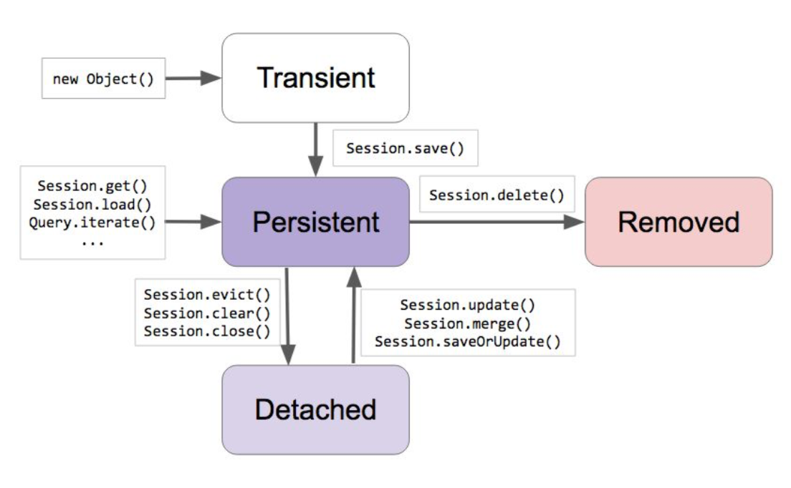

# JPA 프로그래밍 5. 엔티티 상태와 Cascade
> Cascade: 엔티티 상태​ 변화를 전파 시키는 옵션  

## 엔티티 상태​가 뭐지
  

  
### Transient: JPA가 모르는 상태
> 데이터베이스에 들어갈지 안들어갈지도 전혀 모르는 상태  
> `new Object()`  
### Persistent: JPA가 관리중인 상태
> Persistent 상태가 됐다고 바로 Insert가 발생해서 데이터베이스에 저장하지 않음  
> Persistent 에서 관리하고 있던 객체가 데이터베이스에 넣는 시점에 데이터를 저장함  
> `Session.save()`, `Session.get()`, `Session.load()`, `Query.iterate()` ...  
> `Session.update()`, `Session.merge()`, `Session.saveOrUpdate()`  
- 1차 캐시: Persistent Context(EntityManager, Session)에 인스턴스를 넣은 것  
  > 아직 저장이 되지 않은 상태에서 다시 인스턴스를 달라고 하면 이미 객체가 있으므로 데이터베이스에 가지 않고 캐시하고 있는 것을 줌  
- Dirty Checking: 이 객체의 변경사항을 계속 감지
- Write Behind: 객체의 상태의 변화를 데이터베이스에 최대한 늦게 가장 필요한 시점에 적용을 함  
  > 원래 가지고 있던 객체의 값과 동일한경우 변경사항을 적용하지 않음  

### Detached: JPA가 더이상 관리하지 않는 상태
> Transaction 이 끝났을 때 이미 데이터베이스에 저장이되고 Session이 끝난 상태  
> `Session.evict()`, `Session.clear()`, `Session.close()`  

### Removed: JPA가 관리하긴 하지만 삭제하기로 한 상태 
> `Session.delete()`  

## Cascade 상태 테스트
#### 1차 캐쉬에 저장된 인스턴스 가져오는 테스트
```java
@Component
@Transactional
public class JpaRunner implements ApplicationRunner {

    @PersistenceContext
    EntityManager entityManager;

    @Override
    public void run(ApplicationArguments args) throws Exception {
        /** Transient 상태 **/
        Account account = new Account();
        account.setUsername("freelife");
        account.setPassword("hibernate");

        Study study = new Study();
        study.setName("Spring Data JPA");

        account.addStudy(study);

        /** Persistent 상태 **/
        session.save(account);
        session.save(study);

        // 데이터베이스에 가지 않고 이미 1차 캐쉬에 저장된 인스턴스를 가져옴 
        Account freelife = session.load(Account.class, account.getId());
        freelife.setUsername("ironman");
        System.out.println("=====================");
        System.out.println(freelife.getUsername());
    }
}
```

#### 데이터 변경이 일어 나지 않는 테스트
> 여러번 적용해서 마지막에 데이터가 1차캐시의 객체 값과 같다면 데이터를 변경하지 않는다  
```java
Account freelife = session.load(Account.class, account.getId());
freelife.setUsername("ironman");
freelife.setUsername("superman");
freelife.setUsername("freelife");
System.out.println("=====================");
System.out.println(freelife.getUsername());
```

## Parent 와 Child 예시
### Cascade를 적용하지 않은 테스트
#### Parent인 Post 클래스 생성
```java
@Entity
public class Post {

    @Id @GeneratedValue
    private Long id;
    private String title;

    @OneToMany(mappedBy = "post")
    private Set<Comment> comments = new HashSet<>();
    public void addComment(Comment comment) {
        this.getComments().add(comment);
        comment.setPost(this);
    }
}
```

#### Child인 Comment 클래스 생성
```java
@Entity
public class Comment {

    @Id @GeneratedValue
    private Long id;
    private String comment;

    @ManyToOne
    private Post post;
}
```

#### JpaRunner에 post 데이터 저장 테스트
> Cascade를 적용하지 않으면 post만 저장되고 comment에 전파되지 않는다  
```java
@Component
@Transactional
public class JpaRunner implements ApplicationRunner {

    @PersistenceContext
    EntityManager entityManager;

    @Override
    public void run(ApplicationArguments args) throws Exception {
        Post post = new Post();
        post.setTitle("Spring Data JPA 언제 보나...");

        Comment comment = new Comment();
        comment.setComment("빨리 보고 싶엉.");
        post.addComment(comment);

        Comment comment1 = new Comment();
        comment1.setComment("곧 보여드릴께요.");
        post.addComment(comment1);

        Session session = entityManager.unwrap(Session.class);
        session.save(post);
    }
}
```

## Cascade를 적용한 테스트
- Post에 cascade = CascadeType.PERSIST 옵션 적용  
> Post를 저장할 때 저장하는 Persistent를 comments에 전파  
> post 라는 인스턴스가 Transient에서 Persistent 상태로 넘어갈때   
> Child에 연관관계에 있어 참조하고 있던 객체들도 같이 Persistent 상태가 되면서 같이 저장이 됨  
```java
@OneToMany(mappedBy = "post", cascade = CascadeType.PERSIST)
private Set<Comment> comments = new HashSet<>();
public void addComment(Comment comment) {
    this.getComments().add(comment);
    comment.setPost(this);
}
```

## Cascade Persistent와 Removed를 적용한 테스트
#### Post에 cascade = {CascadeType.PERSIST, CascadeType.REMOVE}) 옵션 적용  
```java
@OneToMany(mappedBy = "post", cascade = {CascadeType.PERSIST, CascadeType.REMOVE})
private Set<Comment> comments = new HashSet<>();
public void addComment(Comment comment) {
    this.getComments().add(comment);
    comment.setPost(this);
}
```

#### Post 삭제 테스트
> post의 1에 해당되는 것을 가져와 삭제해달라고 하면  
> delete를 호출하는 순간 Removed 상태가 되고 Removed 상태가 전파되어 comment들도 같이 Removed 상태가 된다음  
> Transaction이 Commit이 일어날때 데이터가 모두 Remove 됨  
```java
@Component
@Transactional
public class JpaRunner implements ApplicationRunner {

    @PersistenceContext
    EntityManager entityManager;

    @Override
    public void run(ApplicationArguments args) throws Exception {
        Session session = entityManager.unwrap(Session.class);
        Post post = session.get(Post.class, 1l);
        session.delete(post);
    }
}
```

## 일반적인 Cascade 옵션 설정
> 보통은 아래와 같이 cascade = CascadeType.ALL 로 주어서 다 전파하면 됨  
```java
@OneToMany(mappedBy = "post", cascade = CascadeType.ALL)
private Set<Comment> comments = new HashSet<>();
public void addComment(Comment comment) {
    this.getComments().add(comment);
    comment.setPost(this);
}
```