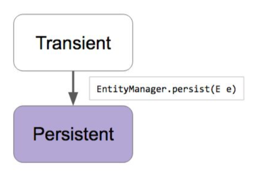

# 스프링 데이터 JPA: 엔티티 저장하기
## JpaRepository의 save()는 단순히 새 엔티티를 추가하는 메소드가 아닙니다
> 내부적으로 save()는 객체가 새로운 객체인지 다른 객체인지 판단을 함  
- Transient(새로운) 상태의 객체라면 EntityManager.persist()
- Detached(이미있는) 상태의 객체라면 EntityManager.merge()
 
## Transient인지 Detached 인지 어떻게 판단 하는가?
- 엔티티의 @Id 프로퍼티를 찾는다. 해당 프로퍼티가 null이면 Transient 상태로 판단하고 id가 null이 아니면 Detached 상태로 판단한다
- 엔티티가 Persistable 인터페이스를 구현하고 있다면 isNew() 메소드에 위임한다
- JpaRepositoryFactory를 상속받는 클래스를 만들고 getEntityInfomration()을 오버라이딩해서 자신이 원하는 판단 로직을 구현할 수도 있습니다
 
## EntityManager.persist()
https://docs.oracle.com/javaee/6/api/javax/persistence/EntityManager.html#persist(java.lang.Object)
  
> Persist() 메소드에 넘긴 그 엔티티 객체를 Persistent 상태로 변경합니다  
  


- Transient 상태의 객체: 새로 만들어진 객체라서 ID가 없고 ID에 맵핑되는 데이터베이스 레코드가 전혀 없는 상태라  
  Hibernate, Database 둘 다 아무도 모름  
- Persistent: Transient 상태의 객체를 persist 했을 때 persistenceContext 가 관리를 하는 상태  
  상태변화를 감지하거나 필요할때 마다 데이터베이스 sync를 하거나  

## EntityManager.merge()
https://docs.oracle.com/javaee/6/api/javax/persistence/EntityManager.html#merge(java.lang.Object)
> Merge() 메소드에 넘긴 그 엔티티의 복사본을 만들고, 그 복사본을 다시 Persistent 상태로 변경하고 그 복사본을 반환합니다  
> 데이터베이스에 sync를 하는 거라 Entity의 상태변화를 데이터베이스에 Update 시킴  
> ID가 데이터베이스에 해당하는게 없으면 새로운 데이터를 Insert 함  
  

  
- Detached 상태의 객체: 한 번이라도 데이터베이스에 Persistent 상태가 됐던 객체
  이 객체에 맵핑이 되는 레코드가 테이블에 있는 경우 즉, 이 객체는 ID가 있음 ID에 맵핑이 되는 테이블 데이터가 있을 수도 있고 없으면 새로 추가

## 실습
#### 테스트 코드 작성
```java
@RunWith(SpringRunner.class)
@DataJpaTest
public class PostRepositoryTest {

  @Autowired
  PostRepository postRepository;

  @PersistenceContext
  private EntityManager entityManager;

  @Test
  public void save() {
    Post post = new Post();
    post.setTitle("Jpa");
    Post savedPost = postRepository.save(post);// id가 없어서 EntityManager.persist()

    // entityManager가 post 인스턴스를 캐싱하고 있으므로 true
    assertThat(entityManager.contains(post)).isTrue();
    // entityManager가 savedPost 인스턴스도 가지고 있으므로 true
    assertThat(entityManager.contains(savedPost)).isTrue();
    // 두 인스턴스는 같음
    assertThat(savedPost == post);

    Post postUpdate = new Post();
    postUpdate.setId(post.getId());
    postUpdate.setTitle("hibernate");
    // 리턴 받는 UpdatedPost 가 영속화가 되고 파라메터로 넘긴 postUpdate는 영속화가 되지 않음
    Post updatedPost = postRepository.save(postUpdate);// id가 있으므로 EntityManager.merge()

    // entityManager가 updatedPost 인스턴스를 캐싱하고 있으므로 true
    assertThat(entityManager.contains(updatedPost)).isTrue();
    // entityManager가 postUpdate 인스턴스를 캐싱하고 있지 않으므로 false
    assertThat(entityManager.contains(postUpdate)).isFalse();
    // 두 인스턴스는 서로 다름
    assertThat(updatedPost == postUpdate);

    // 이런식으로 파라메터로 전달한 인스턴스를 사용하면 persist 상태가 아니므로 상태변화를 감지 안함
    // 그래서 그냥 Hibernate 임 updatedPost를 사용해야 제대로 감지함
    postUpdate.setTitle("ironman");

    List<Post> all = postRepository.findAll();
    assertThat(all.size()).isEqualTo(1);
  }
}
```

#### ID가 없어서 EntityManager.persist() 발생하는 로직
- id가 없으므로 새로운 객체 이므로 Transient 상태의 객체이고 Persist() 메소드에 객체를 넘김
- Persist() 에 넘겨준 인스턴스 자체가 영속화가 됨
- `entityManager.contains(post)` 객체가 영속화가 됨
- `postRepository.save(post)`에서 리턴되는 인스턴스는 항상 영속화 되어있는 객체를 리턴해줌
- 리턴 되는 객체와 넘겨준 객체는 서로 다를 수 있지만 아래의 `savePost`와 오른쪽 객체는 같음
```java
Post post = new Post();
post.setTitle("Jpa");
Post savedPost = postRepository.save(post);// id가 없어서 EntityManager.persist()

// entityManager가 post 인스턴스를 캐싱하고 있으므로 true
assertThat(entityManager.contains(post)).isTrue();
// entityManager가 savedPost 인스턴스도 가지고 있으므로 true
assertThat(entityManager.contains(savedPost)).isTrue();
// 두 인스턴스는 같음
assertThat(savedPost == post);
```

#### ID가 있으므로 EntityManager.merge() 발생하는 로직
- merge가 발생하면 Update 쿼리가 발생하고 즉, JPA 대신에 Hibernate로 값을 업데이트 하게 됨
- 전달받은 postUpdate에 복사본을 만들어서 그 복사본을 가지고 데이터베이스 영속화를 하고
- 이 복사본은 Persistent 상태로 만들지 않고 복사본 자체를 리턴해줌
```java
Post postUpdate = new Post();
postUpdate.setId(post.getId());
postUpdate.setTitle("hibernate");
// 리턴 받는 UpdatedPost 가 영속화가 되고 파라메터로 넘긴 postUpdate는 영속화가 되지 않음
Post updatedPost = postRepository.save(postUpdate);// id가 있으므로 EntityManager.merge()

// entityManager가 updatedPost 인스턴스를 캐싱하고 있으므로 true
assertThat(entityManager.contains(updatedPost)).isTrue();
// entityManager가 postUpdate 인스턴스를 캐싱하고 있지 않으므로 false
assertThat(entityManager.contains(postUpdate)).isFalse();
// 두 인스턴스는 서로 다름
assertThat(updatedPost == postUpdate);
```

## Managed 객체의 장점
> 내가 명시적으로 업데이트를 하라고 알려주지 않아도  
> Hibernate, JPA가 알아서 객체상태의 변화를 감지하다가 필요하다고 느낀 시점에 데이터베이스에 sync를 하고 가져오게 하면  
> 최신상태의 변화상태를 제대로 가져올 수 있으니까 지금 이 Transaction 안에서 변화를 제대로 가져올 수 있으니까 반영시킴  
```java
List<Post> all = postRepository.findAll();
assertThat(all.size()).isEqualTo(1);
```

## 결론
> 파라메터로 전달한 인스턴스를 사용하지 말자!  
> 실수를 줄이기 위해서는 무조건 리턴 받은 인스턴스를 사용하자  