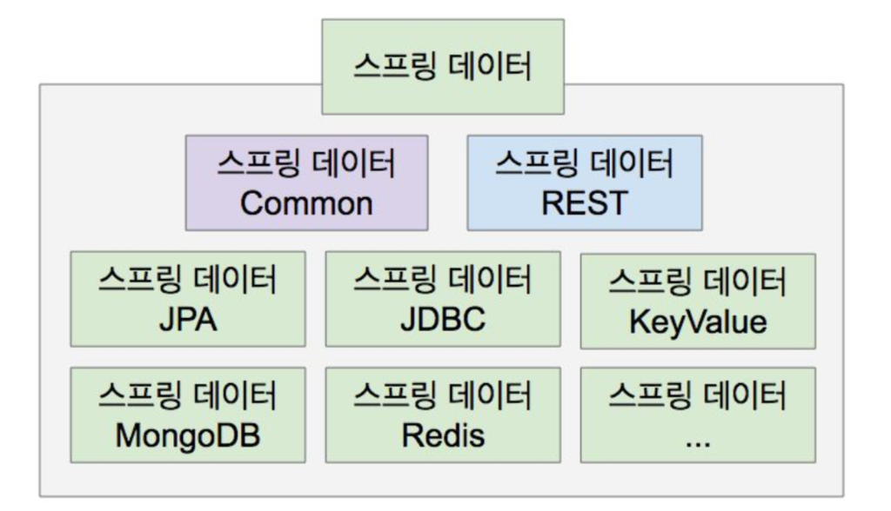

# 스프링 데이터 JPA 활용 파트 소개
https://docs.spring.io/spring-data/jpa/docs/current/reference/html/
    

  
- 스프링 데이터: SQL & NoSQL 저장소 지원 프로젝트의 묶음
- 스프링 데이터 Common: 여러 저장소 지원 프로젝트의 공통 기능 제공
- 스프링 데이터 REST: 저장소의 데이터를 하이퍼미디어 기반 HTTP 리소스로(REST API로) 제공하는 프로젝트
- 스프링 데이터 JPA: 스프링 데이터 Common이 제공하는 기능에 JPA 관련 기능 추가