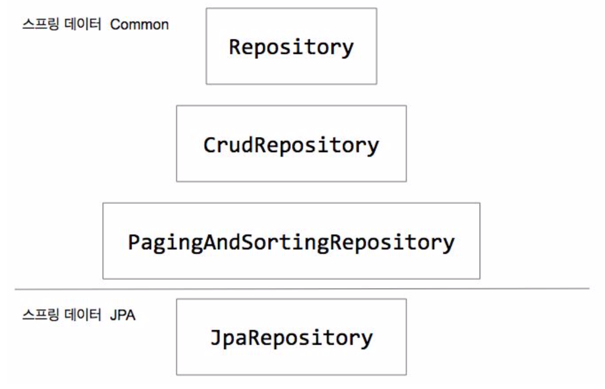

# 스프링 데이터 Common: Repository
  

  
## 스프링 데이터 Common
- Repository: Marker 용
- CrudRepository: 기본적인 CRUD 오퍼레이션들을 제공
- PagingAndSortingRepository

## @NoRepositoryBean
> 스프링 데이터 JPA 또는 스프링 데이터 다른 저장소용 Repository가 적용된 빈의 실제 빈을 만들지 않도록  
> 방지하기 위하여 CrudRepository에 적용함  

## JPA 슬라이싱 테스트
### @DataJpaTest
> 스프링 부트에서 제공하는 데이터 엑세스 레이어만 테스트 하는 애노테이션  
> Repository 관련된 빈들만 등록됨  

### 테스트 실습
> h2는 기본적으로 @Transactional 이 붙어있으면 모든 테스트는 Rollback을 함  
> hibernate는 필요할때만 데이터베이스에 Query를 Sync하는데 Rollback한 Query라서 데이터를 Insert하지 않음  
> 결론적으로 ID 만 가져오고 Insert Query를 날리지 않고 끝냄  
#### Rollback 되는 테스트
```java
@RunWith(SpringRunner.class)
@DataJpaTest
public class PostRepositoryTest {

    @Autowired
    PostRepository postRepository;

    @Test
    public void crudRepository() {
        // Given - 이런 조건 하에서
        Post post = new Post();
        post.setTitle("hello spring boot common");
        assertThat(post.getId()).isNull();

        // When - 이렇게 했을때
        Post newPost = postRepository.save(post);

        // Then - 이렇게 되길 바란다
        assertThat(newPost.getId()).isNotNull();
    }
}
```

#### Rollback이 되지 않도록 @Rollback(false) 로 지정
- newPost가 PersistenceContext에 들어가고 findAll은 Query를 만들어서 실행하니까 실제 Query가 날아감  
- 내가 PersistenceContext에 가지고 있는 객체가 데이터베이스의 전체 데이터라는 보장은 없으니까 Query를 보냄  
- page는 `page`라는 도메인으로 나옴 요청시에는 `pageable` 이라는 Parameter로 요청해야함  
```java
@RunWith(SpringRunner.class)
@DataJpaTest
public class PostRepositoryTest {

    @Autowired
    PostRepository postRepository;

    @Test
    @Rollback(false)
    public void crudRepository() {
        // Given - 이런 조건 하에서
        Post post = new Post();
        post.setTitle("hello spring boot common");
        assertThat(post.getId()).isNull();

        // When - 이렇게 했을때
        Post newPost = postRepository.save(post);

        // Then - 이렇게 되길 바란다
        assertThat(newPost.getId()).isNotNull();

        // when
        List<Post> posts = postRepository.findAll();

        // Then
        assertThat(posts.size()).isEqualTo(1);
        assertThat(posts).contains(newPost); // newPost 인스턴스를 posts 컬렉션이 가지고 있어야 된다

        // When - 0페이지 부터 10개의 페이지를 달라고 요청
        Page<Post> page = postRepository.findAll(PageRequest.of(0, 10));
        assertThat(page.getTotalElements()).isEqualTo(1); // 전체 페이지 개수
        assertThat(page.getNumber()).isEqualTo(0); // 현재 페이지 넘버
        assertThat(page.getSize()).isEqualTo(10); // 요청했던 사이즈
        assertThat(page.getNumberOfElements()).isEqualTo(1); // 현재 페이지에 들어올 수있는 개수
    }
}
```

### Custom 메서드 추가
https://docs.spring.io/spring-data/jpa/docs/current/reference/html/#repositories
  
> 이러한 Repository Interface는 Custom한 메서드를 추가 할 수있음  
> 어떠한 특정한 키워드를 가지고 있는 Post 목록을 페이징을 해서 찾겠다 라는 메서드 추가  
> 메서드의 이름을 분석해서 SpringDataJPA가 Query를 만들어줌  
#### PostRepository에 Custom 메서드 추가
```java
import org.springframework.data.domain.Page ;
import org.springframework.data.domain.Pageable;
import org.springframework.data.jpa.repository.JpaRepository;

public interface PostRepository extends JpaRepository<Post, Long> {

    Page<Post> findByTitleContains(String title, Pageable pageable);
}
```

#### 테스트 코드 
> findAll 과 결과가 같은 것을 확인할 수 있음  
```java
page = postRepository.findByTitleContains("spring", PageRequest.of(0, 10));

assertThat(page.getTotalElements()).isEqualTo(1); // 전체 페이지 개수
assertThat(page.getNumber()).isEqualTo(0); // 현재 페이지 넘버
assertThat(page.getSize()).isEqualTo(10); // 요청했던 사이즈
assertThat(page.getNumberOfElements()).isEqualTo(1); // 현재 페이지에 들어올 수있는 개수
```

### 또 다른 Custom 메서드 추가
> 좀 더 다양한 Custom 메서드를 추가 할 수 있음  
```java
public interface PostRepository extends JpaRepository<Post, Long> {

    long countByTitleContains(String title);
}
```

#### 테스트 코드
```java
// when - spring을 가지고 있는 개수를 모두 센다
long spring = postRepository.countByTitleContains("spring");
// then
assertThat(spring).isEqualTo(1); // 개수는 1이다
```